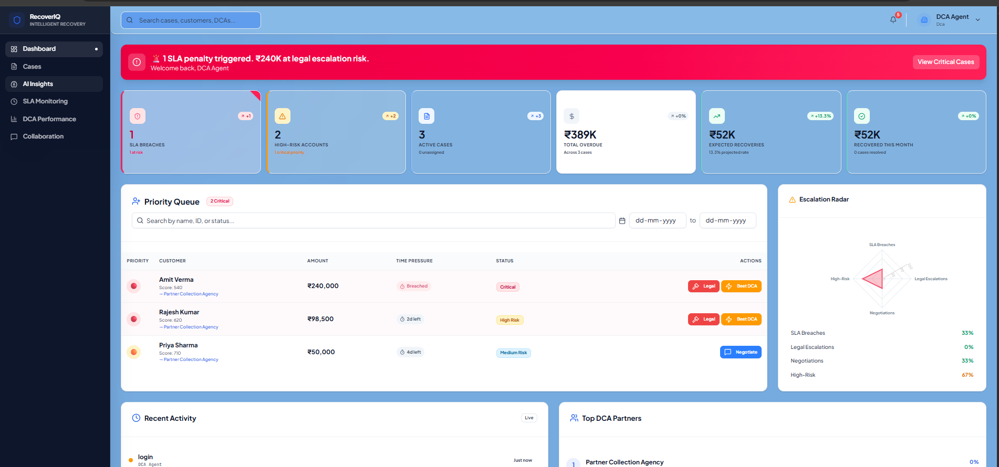
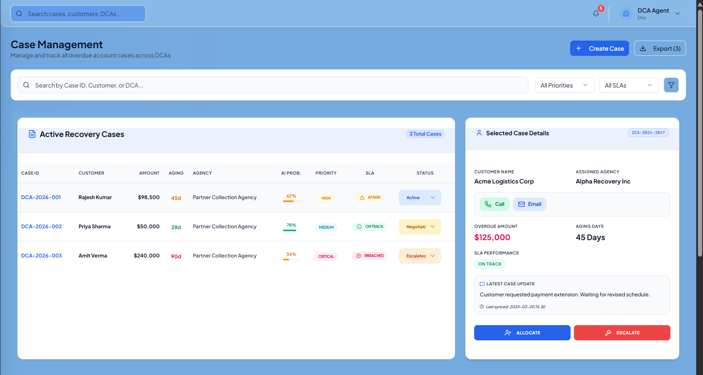
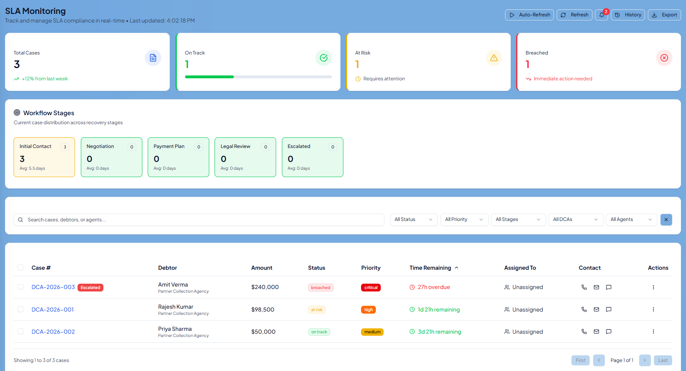

# FedEx DCA Management Platform

Live Demo: https://fed-ex-dca-managment.vercel.app

## Overview
A full-stack debt collection management platform developed for the FedEx Smart Hackathon (Top 15 Finalist, IIT Madras). The platform enables case allocation, SLA monitoring, DCA performance tracking, analytics, and collaboration workflows.

## Screenshots

### Dashboard

### Case Allocation

### SLA Monitoring

## Features
- Role-based Authentication (Admin & DCA)
- Case Creation & Management
- DCA Allocation
- SLA Monitoring & Alerts
- Performance Analytics
- Activity Logs & Audit Trail
- Payment Tracking

## Tech Stack
- Next.js
- TypeScript
- PostgreSQL
- Supabase
- Drizzle ORM
- Tailwind CSS
- Vercel

## Achievement
 Top 15 Finalist – FedEx Smart Hackathon, Shaastra IIT Madras

## Run Locally

npm install
npm run dev

## Author
Mohammed Muzammil
